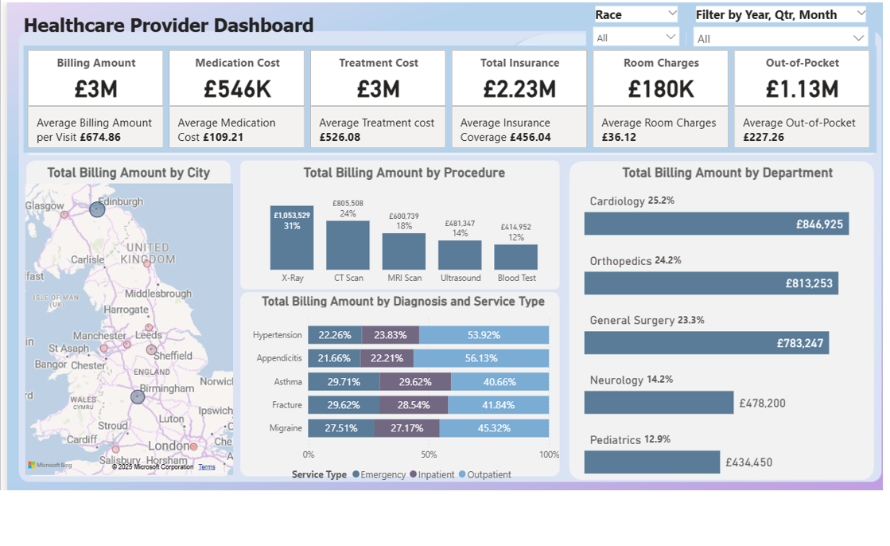

# Healthcare-Provider-Dashboard
This project showcases a comprehensive and visually engaging Healthcare Provider Dashboard using Power BI. It focuses on analyzing financial performance, provider efficiency, and key operational trends of healthcare centres across the UK for the years 2024 and 2025. The primary objective is to transform raw healthcare data into clear, actionable insights for decision-makers in the healthcare industry.

**Key Highlights**

**Financial Analysis**

  •	Assess the overall financial health of the healthcare centres across various UK cities during 2024 and 2025.
  
  •	Analyze revenue by procedure, diagnosis, service type, and department.

**Provider Insights**
  •	Evaluate the performance of healthcare providers based on service type and financial metrics.

**Trends and KPIs**
  •	Monitor and track key performance indicators (KPIs) to support strategic planning and decision-making.
    	Billing Amount
    	Medication Cost
    	Treatment Cost
    	Total Insurance Coverage
    	Room Charges
    	Out-of-Pocket Charges

**Key Visualizations**
•	Geographic Bubble Map: Visualize Total Billing Amount by City across the UK using a bubble-based geographic map.
•	Procedure Breakdown: Show billing totals and percentages for common procedures such as CT Scan, X-Ray, Ultrasound, Blood Test, and MRI Scan.
•	Diagnosis & Service Type: Analyze billing by medical diagnosis and service type (Inpatient, Outpatient, Emergency).
•	Department Overview: Display total and percentage billing across key departments including General Surgery, Cardiology, Neurology, Paediatrics, and Orthopaedics.

**Tools Used**
•	Power BI Desktop – Dashboard creation and report modeling
•	Power Query – Data import, cleansing and transformation 
•	DAX – Custom KPI calculations and data modeling
•	PowerPoint – Creation of custom dashboard backgrounds for visual consistency

